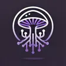

<p align="center">
  
</p>

<h1 align="center">Mycelian</h1>

<p align="center">
  <strong>Your all-in-one streaming control room — alerts, overlays, chatbot, and automation in one desktop app.</strong>
</p>

<p align="center">
  <a href="https://www.python.org/downloads/">=3.10"></a>
  <a href="LICENSE"></a>
  
  
</p>

<p align="center">
  Mycelian is a streaming toolkit for Twitch creators who want polished alerts, interactive browser sources, and deep integrations — without juggling a dozen separate tools. A modern desktop app configures everything; a built-in web server at <code>http://localhost:5000</code> feeds real-time overlays to OBS through WebSocket-powered templates.
</p>

---

## What is Mycelian?

Mycelian brings your stream's alerts, overlays, chatbot, and automation into a single desktop application. Configure alerts and templates in the UI, drop browser sources into OBS, and let everything stay in sync in real time — from follows and subs to Spotify now-playing, PSN trophies, and custom interactive games.

**How it fits together:** desktop config UI ↔ Flask / Socket.IO server ↔ OBS browser sources

---

## Features

### Alerts

- Follows, subs, bits, raids, donations, channel points, and PSN trophy notifications
- Custom GIF animations and audio per alert type
- Live activity feed with history, replay, and skip controls

### Browser Sources & Templates

- Ready-made overlays: activity feed, BitBoss, chat, counters, roulette, now playing, and more
- Served locally at `http://localhost:5000/{template_name}` for OBS and other streaming software
- JSON-driven configuration with real-time WebSocket updates

### Spore Studio

- Visual overlay designer for building custom browser sources
- Event bindings, data displays, counters, and Stream Deck actions
- Preview and export templates without hand-writing boilerplate

### Source Controls

- Push live controls from the desktop app to overlays mid-stream
- Toggle states, counters, and dynamic values without refreshing browser sources

### Chatbot

- Custom commands with variables, cooldowns, and user-level permissions
- Automated event responses, quotes, greetings, and giveaways

### Connectors

- Trigger → condition → action automation workflows
- Chain Twitch events, OBS actions, template updates, and more

### Integrations

- **Twitch** — OAuth, EventSub, chat, channel points
- **Spotify** — Now playing with album artwork
- **PlayStation Network** — Trophy and game-status alerts
- **YouTube** — Channel monitoring and chatbot support
- **OBS Studio** — WebSocket scene and source control
- **Stream Deck** — Plugin for alerts, connectors, and template actions

### Desktop App

Tabbed interface for everything in one place:

| Tab | Purpose |
|-----|---------|
| Activity Feed | Monitor and replay stream events |
| Alerts | Configure alert types, media, and priority |
| Source Settings | Template URLs and visual configuration |
| Source Controls | Live overlay controls |
| Connectors | Automation workflow designer |
| Chatbot | Commands, events, quotes, giveaways |
| Spore Studio | Custom overlay editor |
| Settings | Integrations, database, and app preferences |

---

## Quick Start

**Requirements:** Python 3.10+, Windows / macOS / Linux, internet for service integrations

```bash
# Install uv: https://docs.astral.sh/uv/getting-started/installation/
git clone https://github.com/mushroomsuprise/Mycelian.git
cd Mycelian
uv sync
uv run python main.py
```

**First-time setup:**

1. Open **Settings** and connect your Twitch account
2. Configure alerts in the **Alerts** tab
3. Copy browser source URLs from **Source Settings** into OBS
4. Watch events roll in on the **Activity Feed** tab

**Popular default browser source URLs:**

| URL | Description |
|-----|-------------|
| `http://localhost:5000/alerts` | Alert notifications |
| `http://localhost:5000/bitboss` | Interactive boss battle |
| `http://localhost:5000/chat` | Live chat overlay |
| `http://localhost:5000/counter` | Interactive counters |
| `http://localhost:5000/roulette` | Roulette wheel |

**Built-in OBS dock URLs:**

| URL | Description |
|-----|-------------|
| `http://localhost:5000/activity_feed` | Real-time alert feed |
| `http://localhost:5000/source_controls` | Live overlay controls |

For WebSocket API details, open the in-app **Help** browser and see the *WebSocket Events* topic.

---

## Building from Source

Compile a standalone executable with PyInstaller:

```bash
uv sync
uv run python build.py
```

The built app lands in the `builds/` directory.

**Additional build notes:**

- **npm** is required to build the Stream Deck plugin (`streamdeck-plugin/mycelian/`)
- **macOS:** Xcode command line tools must be installed (`xcode-select --install`)

---

## Help & Documentation

Mycelian ships with a built-in, searchable help system that stays up to date with the app:

- Click the **?** button in the main window header
- Use contextual help buttons next to individual settings
- Browse topics covering setup, templates, connectors, integrations, and troubleshooting

---

## License

[MIT License](LICENSE) — Copyright (c) 2024–2026 Mycelian

